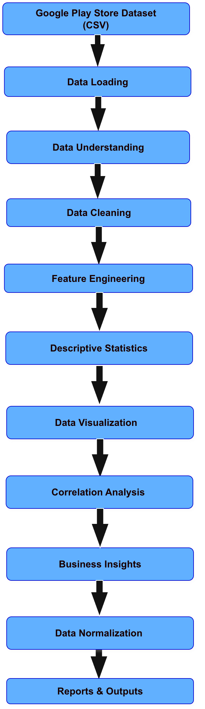
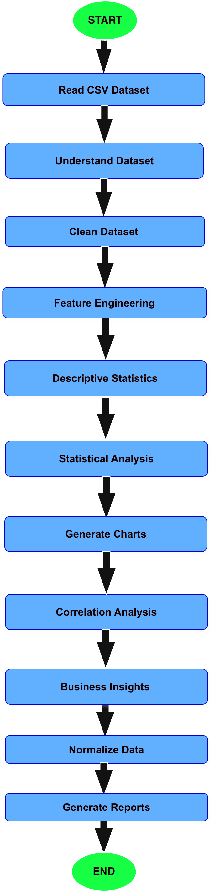
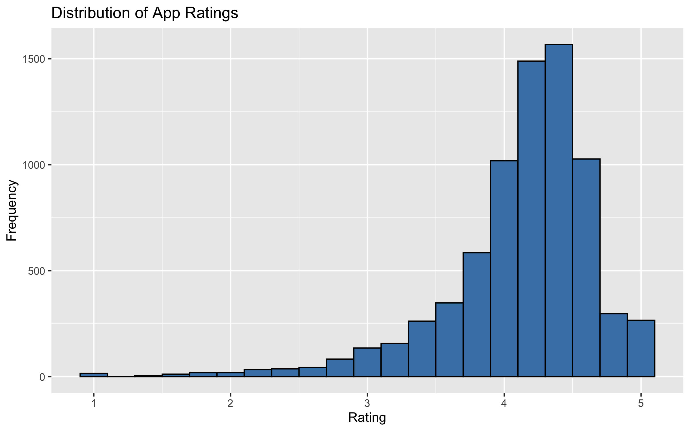
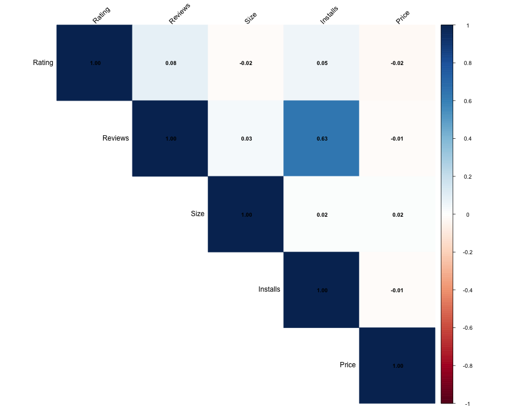
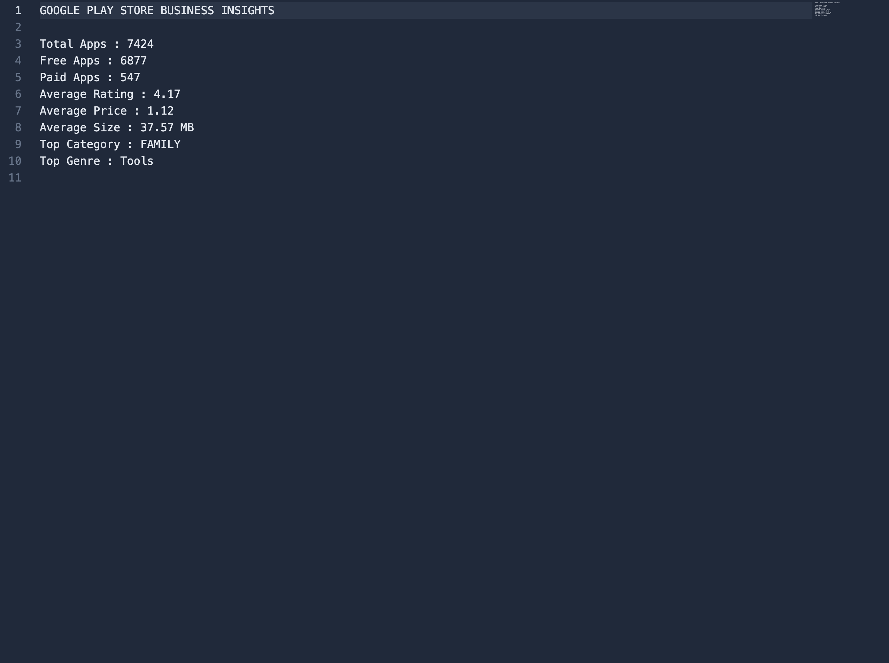

# 📱 Google Play Store Exploratory Data Analysis using R


---

# 📖 Project Overview

This project presents a complete **Exploratory Data Analysis (EDA)** of the **Google Play Store Dataset** using the **R programming language**.

The project follows a modular analytics pipeline that transforms raw application data into meaningful business insights through data preprocessing, statistical analysis, visualization, feature engineering, and reporting.

The objective is to demonstrate professional data analytics practices while producing a reusable, well-documented, and portfolio-ready R project.

---

# 🚀 Project Features

- ✅ Modular R Project Structure
- ✅ End-to-End EDA Pipeline
- ✅ Data Cleaning & Preprocessing
- ✅ Feature Engineering
- ✅ Descriptive Statistics
- ✅ Correlation Analysis
- ✅ Business Insights Generation
- ✅ Min-Max Normalization
- ✅ Z-Score Normalization
- ✅ Automated Report Generation
- ✅ Professional Documentation
- ✅ Architecture & Workflow Diagrams
- ✅ Portfolio-Ready GitHub Repository

---

# 🛠 Technology Stack

| Category | Technology |
|----------|------------|
| Programming Language | R |
| IDE | RStudio |
| Code Editor | Visual Studio Code |
| Data Manipulation | dplyr |
| Data Import | readr |
| Data Reshaping | tidyr |
| String Processing | stringr |
| Visualization | ggplot2 |
| Correlation | corrplot |
| Version Control | Git |
| Repository | GitHub |

---

# 🏗️ Project Architecture

The following architecture illustrates the modular design of the project.



---

# 🔄 Project Workflow

The workflow represents the complete execution pipeline from raw data to business insights.



---

# 📂 Project Structure

```text
google-playstore-eda-r/
│
├── data/
│   ├── raw/
│   │   └── googleplaystore.csv
│   │
│   └── processed/
│       ├── googleplaystore_cleaned.csv
│       ├── googleplaystore_featured.csv
│       ├── googleplaystore_minmax.csv
│       └── googleplaystore_zscore.csv
│
├── docs/
│   ├── architecture.drawio
│   ├── architecture.png
│   ├── workflow.drawio
│   └── workflow.png
│
├── outputs/
│   ├── plots/
│   ├── reports/
│   └── statistics/
│
├── screenshots/
│
├── src/
│   ├── functions/
│   ├── config.R
│   ├── 01_data_loading.R
│   ├── 02_data_understanding.R
│   ├── 03_data_cleaning.R
│   ├── 04_feature_engineering.R
│   ├── 05_descriptive_statistics.R
│   ├── 06_visualization.R
│   ├── 07_correlation_analysis.R
│   ├── 08_business_insights.R
│   ├── 09_normalization.R
│   └── 10_generate_report.R
│
├── README.md
├── PROJECT_REPORT.md
├── LICENSE
└── .gitignore
```

---

# 📦 Project Modules

| Module | Description |
|---------|-------------|
| 01_data_loading.R | Load the Google Play Store dataset |
| 02_data_understanding.R | Explore dataset structure, missing values, duplicates, and data types |
| 03_data_cleaning.R | Clean and preprocess the dataset |
| 04_feature_engineering.R | Create additional analytical features |
| 05_descriptive_statistics.R | Generate descriptive statistical measures |
| 06_visualization.R | Create charts using ggplot2 |
| 07_correlation_analysis.R | Generate correlation matrix and heatmap |
| 08_business_insights.R | Produce business-oriented insights |
| 09_normalization.R | Apply Min-Max and Z-Score normalization |
| 10_generate_report.R | Generate the final project report |

---

# 📊 Outputs Generated

## Processed Data

- Cleaned Dataset
- Feature Engineered Dataset
- Min-Max Normalized Dataset
- Z-Score Normalized Dataset

## Reports

- Descriptive Statistics
- Correlation Matrix
- Business Insights Report
- Final Project Report

## Visualizations

- Rating Distribution Histogram
- Rating Box Plot
- Reviews vs Rating Scatter Plot
- Top Categories
- Price Distribution
- Free vs Paid Applications
- Install Distribution
- Genre Distribution
- Content Rating Distribution
- Average Rating by Category
- Correlation Heatmap
- Additional analytical charts

---

# 📸 Project Screenshots

### Folder Structure


### Rating Distribution



### Correlation Heatmap



### Business Insights



---

# 🚀 Installation

Clone the repository:

```bash
git clone https://github.com/yourusername/google-playstore-eda-r.git
```

Move into the project directory:

```bash
cd google-playstore-eda-r
```

Install the required R packages:

```r
install.packages(c(
  "dplyr",
  "ggplot2",
  "readr",
  "tidyr",
  "stringr",
  "corrplot"
))
```

---

# ▶️ How to Run

Run the project modules in the following order:

```text
01_data_loading.R
        ↓
02_data_understanding.R
        ↓
03_data_cleaning.R
        ↓
04_feature_engineering.R
        ↓
05_descriptive_statistics.R
        ↓
06_visualization.R
        ↓
07_correlation_analysis.R
        ↓
08_business_insights.R
        ↓
09_normalization.R
        ↓
10_generate_report.R
```

---

# 📈 Key Findings

- Most Google Play Store applications are free.
- The Family category contains the highest number of applications.
- Applications with higher review counts generally have higher installation counts.
- Ratings remain consistently high across most categories.
- Price has minimal influence on application ratings.
- Feature engineering improved analytical capabilities.
- Normalization prepared the dataset for future machine learning applications.

---

# 📌 Future Improvements

- Develop an interactive dashboard using Shiny.
- Build predictive models for application ratings.
- Create a recommendation system for applications.
- Perform time-series analysis on app updates.
- Deploy the project as a web-based analytics application.
- Integrate cloud storage and automated pipelines.

---

# 📚 Documentation

This repository includes detailed documentation:

- 📄 **README.md** – Project overview and setup instructions
- 📘 **PROJECT_REPORT.md** – Comprehensive technical report
- 🏗️ **docs/architecture.drawio** – Editable architecture diagram
- 🔄 **docs/workflow.drawio** – Editable workflow diagram

---

# 📄 License

This project is licensed under the **MIT License**.

---

# ⭐ Support

If you found this project useful, please consider giving it a **⭐ Star** on GitHub.

Feedback, suggestions, and contributions are always welcome.